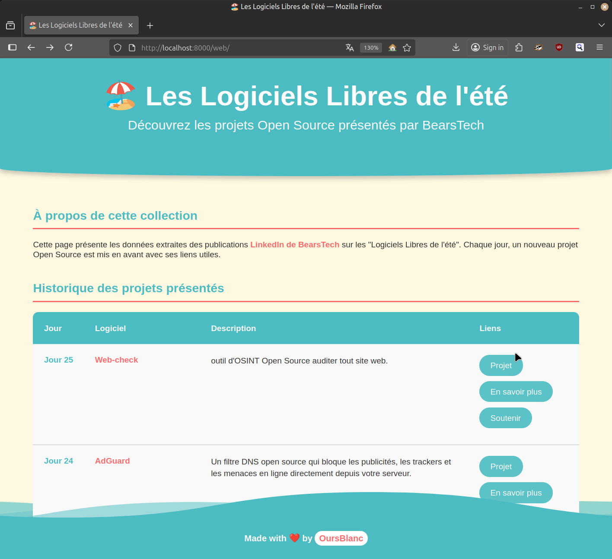

# Bear-Scrap

## Summary

## Live demo

Self-hosted page : [bearscrap.nanuq.me](https://bearscrap.nanuq.me)

## Screenshot



## Presentation

Bearstech, a company specializing in hosting and IT management, publishes a post on LinkedIn every day throughout the summer to showcase free software. The initiative is really cool, but it's not always easy to find these posts on LinkedIn and keep track of them. Being a free software enthusiast, transitioning into IT, and having "OursBlanc" (mean Polar Bear) as my nickname, I had to do something about it!

## Idea

Create a scraping system to retrieve each software presented in these posts and display them on a beautiful, responsive web page to keep a record and find them easily.

I have just completed a year of retraining in IT, so please forgive any minor deviations from best practices as I may not yet have all the instincts and still have much to learn.

## How it works?

I wanted to use an API to scrape posts from the Bearstech page, but it seems it's not possible to scrape company pages that way. So, I used **Selenium** to scrape the page "like a human."

The operation is quite simple:

- There is a **CSV file** (`data/list.csv`) that records the posts from the Bearstech page
- Given that there normally won't be a huge number of entries, I preferred using a `.csv` over a real database

### Project Structure

```
bear-scrap/
├── backend/              # Python scripts
│   ├── main.py          # Main scraping script
│   ├── populate_csv.py  # CSV population functions
│   ├── read_csv.py      # CSV reading functions
│   └── server.py        # Local development server
├── data/                # Data files
│   ├── list.csv        # Scraped projects data
│   └── config          # LinkedIn credentials
├── web/                 # Frontend files
│   ├── index.html      # Main page
│   ├── script.js       # JavaScript functionality
│   ├── style.css       # Styling
│   └── assets/         # Images and resources
├── docs/                # Documentation
│   └── screenshot.png  # Project screenshot
└── requirements.txt     # Python dependencies
```

### Process flow:

1. **Login**: We log in to LinkedIn using the credentials contained in the data/config file
2. **Navigate**: Go to the Bearstech page and scroll through the posts
3. **Identify**: When we find a post titled _"Les logiciels libres de l'été"_, we expand it
4. **Extract**: Scrape the post content using a regex pattern
5. **Filter**: Skip posts that are already in the `.csv` file
6. **Stop condition**: Once we reach _"Logiciel de l'été jour 1"_ (the first one), we stop
7. **Save**: Store all new entries in the `.csv` file

Then everything is shown in a nice website with JS to make DOM

## Installation

### Requirements

- Python 3.x
- Firefox browser
- LinkedIn account credentials

### Populate the CSV

1. **Download** the repository

   ```bash
   git clone https://github.com/OursBlanc42/bear-scrap.git
   cd bear-scrap
   ```

2. **Set up** the environment

   ```bash
   pip install -r requirements.txt
   ```

3. **Edit** data/config file with your credentials

   ```bash
   nano data/config
   # Add your LinkedIn credentials:
   # [credential]
   # email = your-email@example.com
   # password = your-password
   ```

4. **Launch** the script

   ```bash
   python backend/main.py
   ```

5. **Wait** a few minutes

After that, the script has populated the `.csv` and you have your list in the `.csv` file!

### Local testing

You can run a simple server for local testing to see the website with the CSV formatting:

```bash
python backend/server.py
```

Then open your browser and go to [http://localhost:8000/web/](http://localhost:8000/web/) to view the site locally.

## Deployment & Infrastructure

The project is self-hosted on my **Helios64** server. Using **Caddy** as a web server.

- **Automated updates**: A cron job runs daily at 1:00 AM to scan LinkedIn and keep the page continuously updated with new software releases
- **Live demo**: [bearscrap.nanuq.me](https://bearscrap.nanuq.me)

## Disclaimer

Apparently, LinkedIn doesn't really like it when you make a lot of requests like this, so it should be used sparingly. Since we log in with a user account, I think there's a risk of getting permanently banned.

## Improvements

- The algorithmic logic could certainly be improved (I tried to optimize it but couldn't find a way to limit the number of loops with Selenium that rescans all posts each time). Ideally, it would only scan new posts once we've scrolled and display new publications.
- Minor improvements
- Refactorize code
- Optimize execution time of main.py

## License

[](https://creativecommons.org/licenses/by-nc-sa/4.0/)

## Made with love

I made this myself with my bear paws. It's a small personal project to populate my GitHub and help in my job search.

## Acknowledgments

Thanks to [uchardon](https://codepen.io/uchardon/pen/bxbqoG/) for the original wave footer animation that I customized and enhanced for this project.
